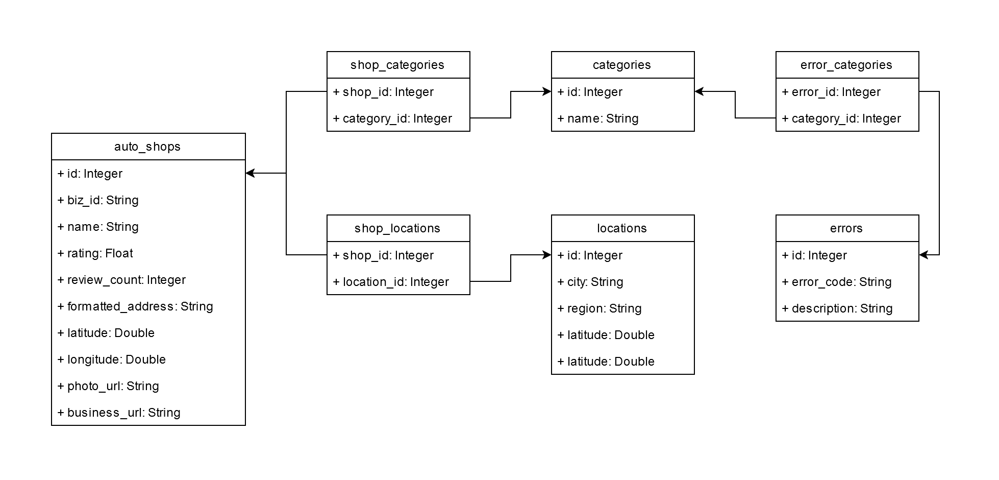

# NeuralOBD
A web-based car diagnostics platform that uses neural networks to analyze uploaded OBD (On-Board Diagnostics) data, suggest potential issues, and recommend nearby workshops. The platform also includes a map feature to locate nearby auto repair shops.  
Curently the model uses this Kaggle dataset: https://www.kaggle.com/datasets/cephasax/obdii-ds3  
For language based responses microsoft/Phi-3-mini-4k-instruct model is used: https://huggingface.co/microsoft/Phi-3-mini-4k-instruct.


## Features
- Upload and analyze OBD diagnostic files.
- Neural network-based fault detection.
- Suggestions for nearby workshops based on diagnostic results.
- Interactive map for locating nearby repair shops.

## Setup Guide

Follow these steps to set up the project locally:

### 1. Clone the Repository
```bash
git clone https://github.com/Kuzenny-ns/NeuralOBD.git
cd NeuralOBD
```

### 2. Create a Virtual Environment
```bash
python -m venv venv
source venv/bin/activate # On Windows: venv\Scripts\activate
```

### 3. Install Dependencies
```bash
pip install -r requirements.txt
```

### 4. Set Up Environment Variables
Create a `.env` file in the root directory of the project with the following content:
```env
DB_username = root
DB_password = root
DB_host = 127.0.0.1:3306
DB_database = auto_repair
API_KEY = <api_key>
```
- Replace `API_KEY` with your Hugging Face account API key.

### 5. Populate the Database
Run the populate script in virtual environment to set up and populate the MySQL database:
```bash
python -c "from app.scripts import populate; populate()"
```
Database is populated based on SCRAPING_CLEANED_DROPNA.csv and obd-trouble-codes-for-db.csv.  
SCRAPING_CLEANED_DROPNA.csv contains autoshops from 20 cities in California scraped from Yelp. obd-trouble-codes-for-db.csv contains trouble codes that model was trained to classify. Currently it is adjusted for trouble_code_classifier_sigmoid_output.keras model. The order of errors is important. It must be the same as when the model was trained. The model training function prints trouble codes list in proper order in blue color while training.

### 6. Start the Server
Start the FastAPI server:
```bash
uvicorn app.main:app --reload
```

Access the web application at [http://127.0.0.1:8000/](http://127.0.0.1:8000/).

## Model Training Process

The project includes a `model_training.py` script to train a neural network. Below is an overview of the process:

### 1. clean_data() function
- Removes unnecessary columns (e.g., `TIMESTAMP`, `MODEL`, etc.). Some columns are removed because in some cases they have null value which is not suited for training.
- Fills missing values in the `TROUBLE_CODES` column with `NO_ERROR`.
- Normalizes percentage values in columns like `ENGINE_LOAD` and `THROTTLE_POS`.

Example use of function
```bash
clean_data('datasets/exp1_14drivers_14cars_dailyRoutes.csv',
           'datasets/exp1_14drivers_14cars_dailyRoutes_CLEANED.csv')
```

### 2. train_and_save() function
- Reads the cleaned dataset.
- Splits the data into training and testing sets.
- Encodes categorical target variables using `LabelEncoder`.
- Scales feature data for training.
- Builds a neural network using TensorFlow with the following layers:
  - Input layer with 64 neurons.
  - Two hidden layers with 32 and 16 neurons, respectively, using ELU activation.
  - Output layer with `num_of_classes` neurons and sigmoid activation.
- Compiles the model with the Adam optimizer and categorical cross-entropy loss.
- Trains the model using `fit()` and saves the best-performing model based on validation accuracy.
- Evaluates the model on the test set and prints the accuracy.
- Generates a classification report for the predictions.

Example use of function
```bash
train_and_save('datasets/exp1_14drivers_14cars_dailyRoutes_CLEANED.csv',
               ['VEHICLE_ID'],
               ['ENGINE_POWER', 'ENGINE_COOLANT_TEMP', 'ENGINE_LOAD', 'ENGINE_RPM','INTAKE_MANIFOLD_PRESSURE',
                'AIR_INTAKE_TEMP', 'THROTTLE_POS', 'TIMING_ADVANCE'],
                'TROUBLE_CODES',
                'models/trouble_code_classifier_tensorflow_100_epochs.keras',
                17, 100)
```

### 3. local_classify() function
- The script includes a `local_classify` function to classify new data using the trained model.
- Normalizes input features, scales the data, and predicts the class probabilities.
- For each given set of values model returns list of predictions. Variable `threshold` is responsible for what predictions will be considered true and which predictions should be discarded.

Example use of function
```bash
local_classify('models/trouble_code_classifier_sigmoid_output.keras',
               '../OBD-II datasets/app_test.csv',
               ['ENGINE_POWER', 'ENGINE_COOLANT_TEMP', 'ENGINE_LOAD', 'ENGINE_RPM',
                'INTAKE_MANIFOLD_PRESSURE', 'AIR_INTAKE_TEMP', 'THROTTLE_POS', 'TIMING_ADVANCE'],
                ['B0004', 'C0300', 'C1004', 'NO_ERROR',
                 'P0078', 'P0079', 'P007E', 'P007F',
                 'P0133', 'P1004', 'P18D0', 'P18E0',
                 'P18F0', 'P2004', 'P2036', 'P3000',
                 'U1004'],
                 ['ENGINE_LOAD', 'THROTTLE_POS', 'TIMING_ADVANCE', 'ENGINE_POWER'])
```

## Database Tables

The system's database is designed to manage information about auto repair shops, their services, locations, and error codes identified by the machine learning model. Below is an overview of the database tables and their purposes.



### Tables Overview

#### `auto_shops`
Stores information about auto repair shops, including their names, ratings, and locations.  
- `id` (Integer): Primary key for the table.  
- `biz_id` (String): Unique business identifier from Yelp.  
- `name` (String): Name of the auto repair shop.  
- `rating` (Float): Average rating of the shop.  
- `review_count` (Integer): Total number of reviews for the shop.  
- `formatted_address` (String): Full address of the shop.  
- `latitude` (Double): Latitude of the shop's location.  
- `longitude` (Double): Longitude of the shop's location.
- `isAd` (Boolean): If scraped shop appeard as add in search this will be reflected here. 
- `photo_url` (String): URL of the shop's photo.  
- `business_url` (String): URL to the shop’s Yelp page.  

#### `categories`
Stores the categories of services offered by auto repair shops (e.g., "brake repair," "oil change").  
- `id` (Integer): Primary key for the table.  
- `name` (String): Name of the service category.  

#### `locations`
Stores city and region information for auto repair shops.  
- `id` (Integer): Primary key for the table.  
- `city` (String): Name of the city.  
- `region` (String): Name of the region/state.  
- `latitude` (Double): Latitude of the city’s location.  
- `longitude` (Double): Longitude of the city’s location.  

#### `errors`
Stores error codes and their descriptions, representing issues the machine learning model is trained to recognize.  
- `id` (Integer): Primary key for the table.  
- `error_code` (String): OBD-II error code (e.g., "P0301").  
- `description` (String): Description of the error code.  

#### `shop_categories`
Manages the many-to-many relationship between auto repair shops and service categories.  
- `shop_id` (Integer): Foreign key referencing `auto_shops.id`.  
- `category_id` (Integer): Foreign key referencing `categories.id`.  

#### `shop_locations`
Manages the many-to-many relationship between auto repair shops and their locations.  
- `shop_id` (Integer): Foreign key referencing `auto_shops.id`.  
- `location_id` (Integer): Foreign key referencing `locations.id`.  

#### `error_categories`
Manages the many-to-many relationship between error codes and service categories.  
- `error_id` (Integer): Foreign key referencing `errors.id`.  
- `category_id` (Integer): Foreign key referencing `categories.id`.  

### Database Relationships
- **One-to-Many Relationships**:  
  - An auto repair shop can have multiple categories (`auto_shops` ↔ `shop_categories`).  
  - An error code can belong to multiple categories (`errors` ↔ `error_categories`).  
- **Many-to-Many Relationships**:  
  - Shops and categories are linked through `shop_categories`.  
  - Shops and locations are linked through `shop_locations`.  
  - Errors and categories are linked through `error_categories`.